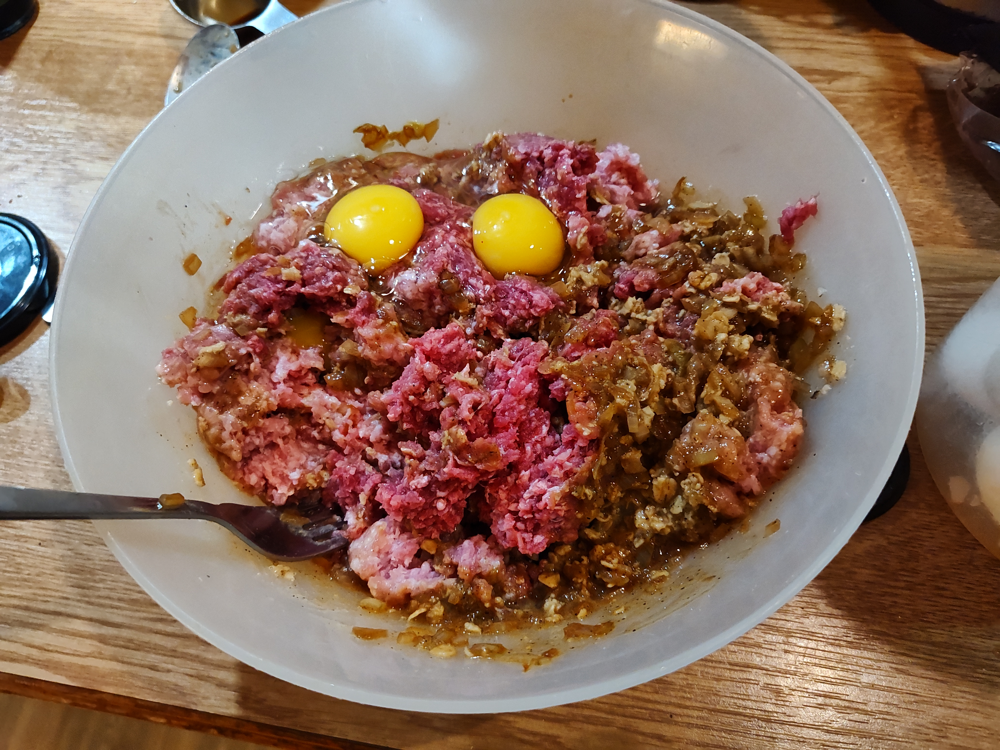
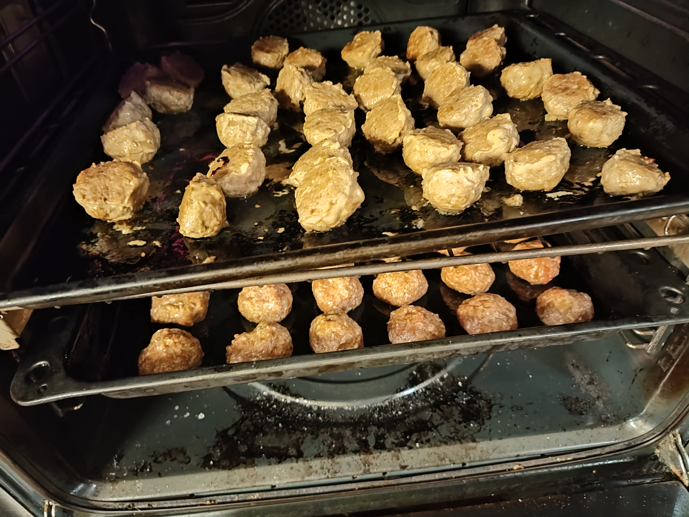

Köttbullar
==========

Till 1 långpanna

Ugn 225° 10+5 min

* 1 lök
* 1 msk ghee
* 30 g sojasås

☝ Finhacka löken, stek i ghee, tillsätt sojasås när löken är lätt brynd.

* 27 g havregryn
* 1 tsk buljongpulver
* 110 g hett vatten 
* 1 msk senap
* 3-4 ml salt
* 3 ml peppar

☝ Blanda och låt svälla

* 500 g köttfärs
* 1 ägg

☝ Blanda allt, ställ i kylskåpet
☝ Städa bänken =)
☝ Forma bollar, grädda nere i ugnen 10 min, vänd alla,
grädda övre delen 5 minuter.  Låt stå i eftervärme om bullarna är
stora.

🎗 Vid dubbelsats gräddas första plåten medan andra rullas ut, flyttas
upp när den andra sätts in och tas ut i 5 minuter.

